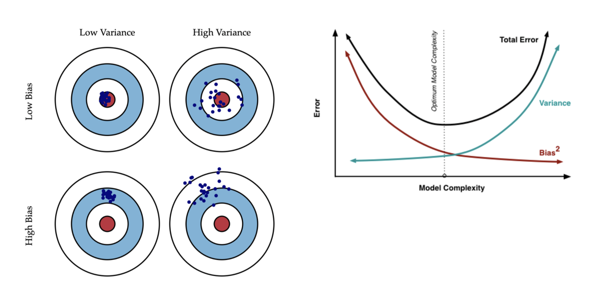
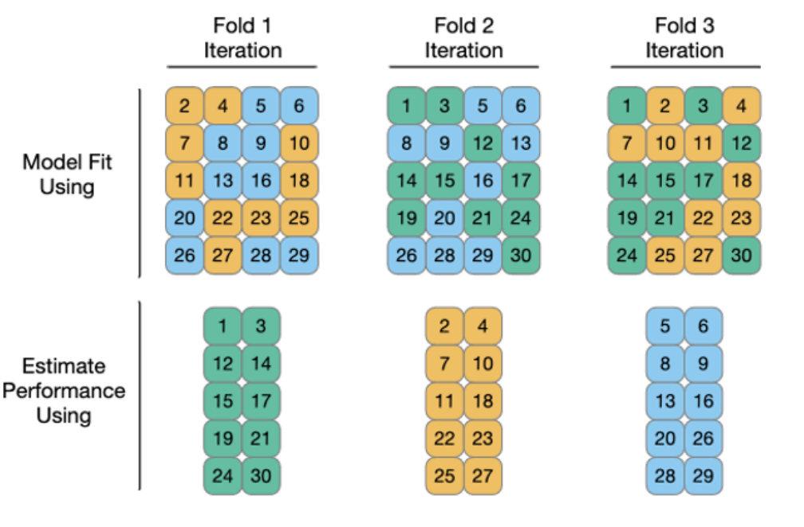
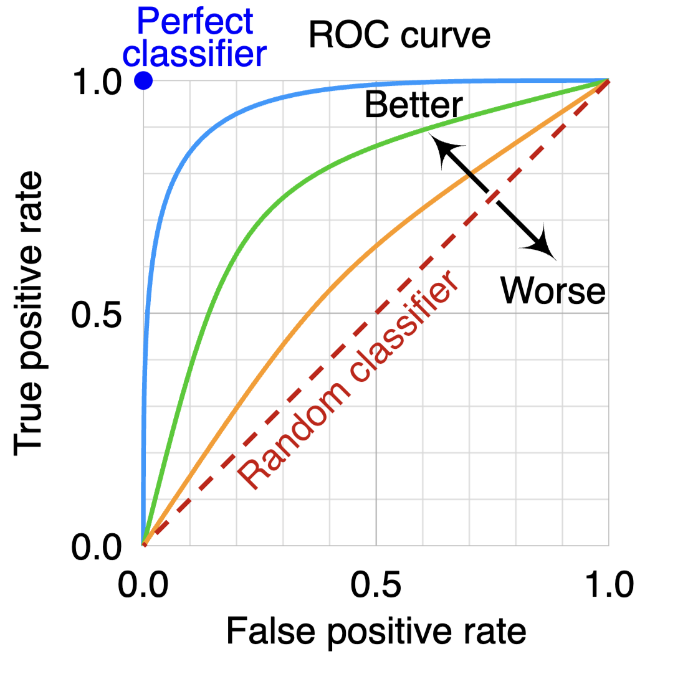

::: {.callout-tip icon="false"}
## Github Repo Link

[Danielle's Repo Link](https://github.com/stat301-3-2026-spring/l01-review-daniellejing2027.git)
:::

## Overview

The goal of this lab is to review machine learning/predictive modeling vocabulary and concepts covered in Data Science 2 with R (STAT 301-2).

## Questions

When completing the following questions ensure your solutions are neatly formatted and clearly indicated. Consider including diagrams/images in some of your solutions, if it helps to make things easier to describe/discuss.

### Question 1

Provide a brief outline/overview of the steps involved in a supervised machine learning process. Could provide this as a bulleted list. 

::: {.callout-tip icon="false"}
## Solution

1. **Define the problem** - Identify the outcome variable (y) and potential predictor variables (x). Determine whether the task is regression or classification.
2. **Prepare and explore the data** - Gather the data, clean it, handle missing values, variable typing, or if any major transformations need to be done. Fix major data issues. Explore how many variables and observations are valid for use (informs splitting decisions as well).
3. **Split the data** - Divide the dataset into training and testing sets. Stratify by outcome variable. For v-fold cross validation, choose an appropiate number of folds and repeats for dataset size. 
4. **Preprocess the data** - Conduct a brief EDA to explore variable relationships using the training dataset. Using these insights, apply transformations and feature engineering (e.g., normalization, dummy encoding, interactions, imputations, etc.) using a recipe. Can also use a kitchen sink recipe alongside the feature engineered recipe in order to see the effect of the feature engineered steps on predictive accuracy.  
5. **Choose models** - Select appropriate models (e.g., linear regression, random forest, elastic net) to fit the training datasets. 
6. **Tune hyperparameters** - Use resampling methods (like v-fold cross validation) to create a tuning hyperparameter grid with appropiate hyperparameter ranges for each model.
7. **Model fitting** - Fit each model type using their respective hyperparameter tuning grids and save the models to project directory. 
8. **Evaluate model performance** - Assess and compare model performance using chosen metrics (e.g., RMSE, accuracy). This step also invovles analysis of autoplots, where you can ascertain whether appropriate hyperparameter tuning tanges were chosen. Once the model with the best performance is identified, extract the workflow with the optimal hyperparameter settings and save this as the final model to be used on the testing dataset. 
9. **Finalize the model** - Fit the best model with optimal hyperparameters on the full training dataset, then evaluate its performance on the unseen testing dataset. Evaluate the results using appropriate metrics and graphs depending on problem type (regression or classification).

:::

### Self Evaluation

::: {.callout-important icon="false"}
## Score 
4

## Explanation

No errors, but the steps could have cleaner delineations. Doesn't match the steps/organization in the solutions answer key, but all the content is correct. 

:::

### Question 2

Explain the difference between supervised and unsupervised learning.

::: {.callout-tip icon="false"}
## Solution

In supervised learning, there is an outcome, a prediction, or target response variable. Data is structured as the target variable (y) and predictor variables (x). In unsupervised learning, there is no outcome/response var, and the goal is to detect patterns in data automatically. The goal isn’t to predict something, it is to learn about patterns in variable x. This variable x is not linked to any type of target variable y. An example of unsupervised learning is clustering. 

:::

### Self Evaluation

::: {.callout-important icon="false"}
## Score 
4 

## Explanation

No errors, but could be a bit more expansive on the goal for supervised learning (fitting a model for predictions on unseen data). 

:::

### Question 3 

In general, we can classify a model by its purpose into 1 of the 3 categories below. Provide a brief description of the goals of these model classes.

#### Descriptive Models 

::: {.callout-tip icon="false"}
## Solution

The goal of descriptive models is to **describe or illustrate characteristics** of some data. Often, the intention is to visually emphasize some trend or artifact of data. E.g. geom_smooth() in scatterplots. 

:::

### Self Evaluation

::: {.callout-important icon="false"}

## Score 
5

## Explanation

No errors or misunderstandings. 

:::

#### Inferential Models

::: {.callout-tip icon="false"}
## Solution

The goal is to produce a **decision for a research question or to test a hypothesis**. The model greatly depends on the underlying assumptions. E.g. whether predictor x1 is important in modeling y. 

:::

### Self Evaluation

::: {.callout-important icon="false"}

## Score 
5

## Explanation

No errors or misunderstandings. 

:::

#### Predictive Models

::: {.callout-tip icon="false"}
## Solution

The goal for predictive models is to produce the **most accurate prediction** possible for new data. 

:::

### Self Evaluation

::: {.callout-important icon="false"}

## Score 
5 

## Explanation

No errors or misunderstandings. 

:::

### Question 4 

We can further describe/classify predictive models by how they were derived or developed as being either mechanistic or empirically driven. 

#### Part (a)

What does it mean to be a mechanistic model?

::: {.callout-tip icon="false"}
## Solution

A mechanistic model assumes that f(x) follows some **known form/equation**. E.g. y = B0 + b1x1 + b2x2 + e (aka linear regression). These models estimate a set of parameters (the betas).
Pros: easy to understand, interpret. Fast. doesn't require a lot of data.
Cons: model form/equation may be a poor fit, limited complexity. 

:::

### Self Evaluation

::: {.callout-important icon="false"}

## Score 

5

## Explanation

No errors or misunderstandings. 

:::

#### Part (b)

What does it mean to be an empirically driven model?

::: {.callout-tip icon="false"}
## Solution

An empirically driven model makes no assumptions about the form of f(x). It uses **specific observations and characteristics** from data.
Pros: Flexible, better predictive performance and power.
Cons: need more observations, longer training time, higher risk of overfitting.

:::

### Self Evaluation

::: {.callout-important icon="false"}

## Score 
3 

## Explanation

Fine answer, but should clarify more on what those specific observations are (patterns and relationshps between variables) and also provide at least one example. 

## Updated solution

An empirically driven model makes no assumptions about the form of f(x). It uses **specific observations and characteristics** from data. An empirically driven model is based on statistical relationships between the input and output variables, and the goal is to capture the patterns in the data without necessarily understanding the underlying processes. Examples include KNN, random forests, artificial neural networks.
Pros: Flexible, better predictive performance and power.
Cons: need more observations, longer training time, higher risk of overfitting.

:::

#### Part (c)

How does the mechanistic and empirically driven model terminology relate to the parametric and nonparametric model terminology? 

::: {.callout-tip icon="false"}
## Solution

Mechanistic models correspond to parametric models, which assume a specific functional form. Empirically driven models correspond to nonparametric models, which do not assume a fixed functional form and instead learn patterns directly from the data.

:::

### Self Evaluation

::: {.callout-important icon="false"}

## Score 
5 

## Explanation

No errors or misunderstandings. 

:::

#### Part (d)

In general, is a mechanistic or empirically driven model easier to interpret? Explain.

::: {.callout-tip icon="false"}
## Solution

In general, **mechanistic (parametric) models** are easier to interpret because they are simpler and defined (by coefficients in linear regression that show relationships between predictors and the outcome). Empirically driven models are often more complex and flexible, making them harder to interpret because they do not have a straightforward equation representing the relationships between the data.

:::

### Self Evaluation

::: {.callout-important icon="false"}

## Score 
5 

## Explanation

No errors or misunderstandings. 

:::

#### Part (e)

How does mechanistic and empirically driven model terminology relate to the idea of model flexibility? That is, which would be more or less flexible than the other.

::: {.callout-tip icon="false"}
## Solution

Empirically driven (nonparametric) models are **more** flexible because they do not assume a specific form that is representative by a function, and thus empirically driven models can adapt to complex patterns in the data. Mechanistic (parametric) models are **less** flexible because they are constrained by their predefined structure.

:::

### Self Evaluation

::: {.callout-important icon="false"}

## Score 
5 

## Explanation

No errors or misunderstandings. 

:::

#### Part (f)

Describe the bias-variance trade-off when considering the use of a mechanistic or empirically driven model. 

::: {.callout-tip icon="false"}
## Solution

Mechanistic models tend to have **higher bias and lower variance** because their structure can oversimplify the true relationships in the data. Empirically driven models and more flexible models tend to have **lower bias and higher variance** because they can closely fit the data but can also overfit to a particular dataset and perform poorly on new, unseen data. The bias variance trade-off involves balancing model bias (simplicity) and variance (flexibility) to obtain optimized predictive performance.

{width=80%}

:::

### Self Evaluation

::: {.callout-important icon="false"}

## Score 
5

## Explanation

No errors or misunderstandings. 

:::

### Question 5 

Explain the difference between a regression and classification machine learning (ML) problems.

::: {.callout-tip icon="false"}
## Solution

Regression machine learning problems involve predicting a **continuous** numeric outcome variable (like price). Classification machine learning problems involve predicting a **categorical** outcome variable (like yes/no). 

:::

### Self Evaluation

::: {.callout-important icon="false"}

## Score 
5 

## Explanation

No errors or misunderstandings. 

:::

### Question 6 

When splitting the data, why is it useful to stratify by the outcome/target variable? 

::: {.callout-tip icon="false"}
## Solution

Stratifying by the outcome/target variable makes sure that the distribution of the target variable is similar across the training and testing datasets. This is particularly important when the distribution of the outcome variable is imbalanced, as it prevents one split from having disproportionately more (or fewer) observations of certain outcome values. This helps with more reliable estimates of model performance.

:::

### Self Evaluation

::: {.callout-important icon="false"}

## Score 
4 

## Explanation

Correct, but should add that overfitting or underfitting is the precise concern from imbalance. 

:::

### Question 7 

Briefly describe how v-fold cross validation with repeats is used to estimate test RMSE. Also provide an explanation of why we use it. 

::: {.callout-tip icon="false"}
## Solution

In v-fold cross validation, data is randomly partitioned into V sets (folds) of roughly equal size. Repeated cross-validation “repeats” the process R times. The model is fit on V - 1 folds and then performance metrics are evaluated on the remaining fold. This process is iterated until all folds have served as the assessment set. The final performance measure would be the average RMSE over V folds. The repeats are for reducing variance. If you have 5 folds and 3 repeats, you should have 15 total fits. The choice for your number of folds and repeats is also based on the bias-variance trade off (and also computation time, if you have a really large dataset). 

The reason why v-fold cross validation is used is because it mimics the training & testing set, and ensures you're not EVALUATING on same data you TUNED on. This reduces bias/overfitting by simulating how the model performs on new/unseen data. 

{width=60%}

:::

### Self Evaluation

::: {.callout-important icon="false"}

## Score 

## Explanation

Explain the score. Clearly identify what your misunderstandings were. Explain why you believe this error/misunderstanding occurred.

## Updated solution

*Only required if a 3 or less is scored on the question.*

:::

### Question 8

When might we use a bootstrap resampling procedure instead of v-fold cross validation to estimate test RMSE?

::: {.callout-tip icon="false"}
## Solution

Bootstrap resampling may be more useful when working with **small datasets**, where splitting into folds may leave too little data for training. It is also helpful when we want to estimate the **variability** or uncertainty of model performance, as bootstrap repeatedly samples with replacement and provides a distribution of performance metrics.

:::

### Self Evaluation

::: {.callout-important icon="false"}

## Score 
3 

## Explanation

Missing the specific use of bootstrap resampling for obtaining LOWER variance, not just estimating variability. 

## Updated solution

Bootstrap resampling may be more useful when working with **small datasets**, where splitting into folds may leave too little data for training. It is also helpful when we want our estimate of the test RMSE to have very **low** variance, as bootstrap repeatedly samples with replacement and provides a distribution of performance metrics. We can run many more bootstraps than folds. 

:::

### Question 9 

Briefly describe model tuning and why we use it.

::: {.callout-tip icon="false"}
## Solution

Model tuning involves selecting the optimal hyperparameters that improve model performance. A hyperparameter is a setting of a model before training begins and is part of the model learning process (trees, mtry, penalty, neighbors, etc.). To tune, you test candidate values with a grid with ranges for each hyperparameter, and select the tuning parameters that provide optimal performance. We use tuning to find the best combination of settings that minimizes error on a given metric (e.g., RMSE) on validation data, helping the model generalize better to new, unseen data.

:::

### Self Evaluation

::: {.callout-important icon="false"}

## Score 

## Explanation

Explain the score. Clearly identify what your misunderstandings were. Explain why you believe this error/misunderstanding occurred.

## Updated solution

*Only required if a 3 or less is scored on the question.*

:::

### Question 10 

What are two common performance metrics when dealing with a regression ML problem?

::: {.callout-tip icon="false"}
## Solution

Two common metrics are: **RMSE (Root Mean Squared Error)** and **MAE (Mean Absolute Error)**.
Root Mean Square Error (RMSE) measures the average difference between predicted and actual values. RMSE calculates the square root of the average squared residuals. A lower RMSE indicates better predictive performance. The Mean Absolute Error (MAE)measures the average magnitude of errors in a set of predictions. It is the average of the absolute differences between actual and predicted values, representing how close predictions are to actual outcomes. A lower MAE means better model performance.

:::

### Self Evaluation

::: {.callout-important icon="false"}

## Score 
5 

## Explanation

No mistakes or errors. 

:::

What are two common performance metrics when dealing with a classification ML problem?

::: {.callout-tip icon="false"}
## Solution

Two common metrics are: **Accuracy** and **ROC-AUC**. 
Accuracy is the ratio of correct predictions (both positive and negative) to the total number of predictions, expressed as a percentage or fraction. ROC AUC is the Area Under the ROC Curve (a one-number summary of the ROC curve). It can be interpreted as the probability that a classifier will rank a randomly chosen positive instance higher than a randomly chosen negative one (assuming ‘positive’ ranks higher than ‘negative’).

{width=60%}

:::

### Self Evaluation

::: {.callout-important icon="false"}

## Score 
5 

## Explanation

No mistakes or errors. 

:::

### Question 11

Classify each question/problem below as either prediction or inferential. Explain your reasoning for each.

A company with a subscription based service (for example Netflix, Disney+, New York Times, etc) has data concerning customer interactions with a them, including features like the number of customer service calls, quality of service calls, subscription length, engagement with the service, discounted service, etc. They are interested in two questions:

1. Does a high number of service calls impact a customer's likelihood of churn in the next month (leave the company/drop the service)?

::: {.callout-tip icon="false"}
## Solution

This is an **inferential** question because it is focused on understanding the relationship and effect of a predictor (number of service calls) on an outcome (churn). This question does not seek a prediction for future outcomes.

:::

### Self Evaluation

::: {.callout-important icon="false"}

## Score 
5 

## Explanation

No mistakes or misunderstandings. 

:::

2. How likely is it that a customer will churn in the next month (leave the company/drop the service)?

::: {.callout-tip icon="false"}
## Solution

This is a **predictive** question because the goal is to predict the probability that a customer will churn in the future, rather than explain why it happens like in the previous question. 

:::

### Self Evaluation

::: {.callout-important icon="false"}

## Score 
5 

## Explanation

No mistakes or misunderstandings. 

:::

